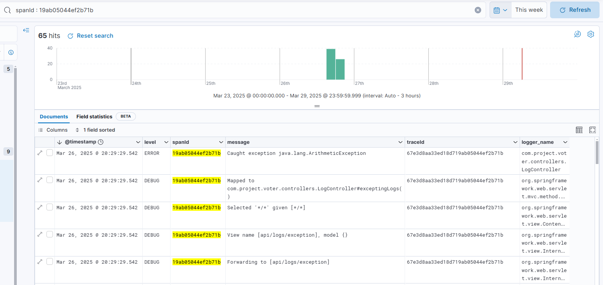

<div align="center">
  
  <h1>Log Monitoring System</h1>
  <p>
    System for log collecting and monitoring based on ELK stack
  </p>
  <!-- Badges -->
  <p>
    <a href="https://github.com/tarkoman4ik/log-monitoring-system/graphs/contributors">
      
    </a>
    <a href="">
      
    </a>
    <a href="https://github.com/tarkoman4ik/log-monitoring-system/forks">
      
    </a>
    <a href="https://github.com/tarkoman4ik/log-monitoring-system/stargazers">
      
    </a>
    <a href="https://github.com/tarkoman4ik/log-monitoring-system/issues/">
      
    </a>
  </p>
  <h4>
      <a href="https://github.com/tarkoman4ik/log-monitoring-system/">View Demo</a>
    <span> · </span>
      <a href="https://github.com/tarkoman4ik/log-monitoring-system">Documentation</a>
    <span> · </span>
      <a href="https://github.com/tarkoman4ik/log-monitoring-system/issues/">Report Bug</a>
    <span> · </span>
      <a href="https://github.com/tarkoman4ik/log-monitoring-system/issues/">Request Feature</a>
  </h4>
</div>

## :information_source: About the project
The system is designed to collect and analyze application logs based on the open-free version of Elastic Stack.

The main feature is easy setup, because all you need to do is configure the .env file and deploy the system in docker. 
The system allows you to collect logs of applications running in different languages.

Applications for testing the monitoring system can be found at the following links:
* [voter][voter-url]
* [todo][todo-url]

### :camera: Screenshots

<div align="center"> 
  
  
  
  
  
</div>

### :exclamation: Requirements for setup
* 10-20 GB on your disk
* Availability of [docker][docker-url]
* Configured .env file

### :computer: Tech Stack

<details>
  <summary>Collecting Logs</summary>
  <ul>
    <li><a href="https://www.elastic.co/beats/filebeat">Filebeat</a></li>
    <li><a href="https://www.elastic.co/logstash">Logstash</a></li>
  </ul>
</details>

<details>
  <summary>Data Storage</summary>
  <ul>
    <li><a href="https://www.elastic.co/elasticsearch">Elasticsearch</a></li>
  </ul>
</details>

<details>
  <summary>Visualisation</summary>
  <ul>
    <li><a href="https://www.elastic.co/kibana">Kibana</a></li>
  </ul>
</details>

<details>
  <summary>Orchestration</summary>
  <ul>
    <li><a href="https://docs.docker.com/compose/">Docker Compose</a></li>
  </ul>
</details>

<details>
  <summary>Infrastructure</summary>
  <ul>
    <li><a href="https://www.docker.com/">Docker</a></li>
    <li><a href="https://docs.docker.com/reference/dockerfile/">Dockerfile</a></li>
  </ul>
</details>

### :key: Environment Variables

To run project, you'll need to add the following environment variables to .env file

|  Env Variable  |  **Description**  |   Required   |
| :-------------: | ------------- | :------------: |
| STACK_VERSION | Version of Elastic Stack  | true |
| CLUSTER_NAME  | Name of Elasticsearch cluster  | true |
| ELASTIC_PORT  | Port for Elasticsearch | true |
| KIBANA_PORT | Port for Kibana | true |
| LOGSTASH_PORT | Port for Logstash | true |
| ELASTIC_HOST | Host where Elasticsearch working |true|
| ELASTIC_USERNAME | Name of superuser |true|
| ELASTIC_PASS | Password for superuser "elastic" |true|
| KIBANA_PASS | Password for user "kibana_system" |true|
| FILEBEAT_PATH | Path to filebeat.yml config | true |
| APP_VOLUME_NAME | The name of the docker volume where the logs will be collected|false|
| PATH_TO_LOGS_HARD | Path to logs at your disk |false|
| APP_PATH_LOGS | Path to logs at filebeat system | false |
| APP_NAME | Name of application which sending log files | false|
| SMTP_USER | Mail address with enabled SMTP | false|
| SMTP_PASS | Generated password for external applications | false |
| SENDING_TO | Mail address to which the notifications will be sent | false |
| TELEGRAM_URL_BOT | HTTP url with your bot token | false |
| USER_CHAT_ID | User's chat id to which the notifications will be sent | false |

### :arrow_forward: Run locally

To clone the project, enter the git command.
```sh
git clone https://github.com/tarkoman4ik/log-monitoring-system.git
```
Go to the project directory
```sh
cd log-monitoring-system
```
If you try to start project from Russia you'll need to enable VPN


Check that the Docker Engine is running and run the docker-compose command
```sh
 docker-compose up -d --build
```

### :test_tube: Testing monitoring system

To test project you can compose 2 project: [voter][voter-url] and [todo][todo-url]

You can find common logging configurations for your Java or Python applications at this links:
* [Java configuration][java-logging]
* [Python configuration][python-logging]   

### 🧩 Integrations

* Filebeat: collecting and pushing log files to logstash
* TCP-to-Logstash by using Logback config (released on Java in [voter][voter-url])

### :email: Alerting

* Mail.ru/Vk.mail.ru alerting by SMTP
* Telegram alerting by TelegramBOT 

### :shield: Security Model

Access rights for Elasticsearch/Kibana/Logstash are created at the time of container creation, where usernames and passwords set from the .env file are used for them.

The differentiation of access rights for external users is configured in Kibana

Standarted role permissions:

* Access to spaces. Allows you to limit the visibility of data and settings within certain spaces.
* Managing Kibana objects: all/read/none. Applies to Dashboards, Visualize, Index Patterns, Maps, ML, Settings.
* Kibana administration: manage/read.

You can create user with required permissions by this instruction:

* Step 1: Login as superuser
* Step 2: Go to the Stack Management
* Step 3: Create role with the necessary permissions
* Step 4: Create user with required role
* Step 5: Login as created user
* Step 6: Discover, manage and analyze data


### :grey_question: FAQ

- Can I disable alerting system?
  + Yes, just leave the variables(SMTP_USER,SMTP_PASS,TELEGRAM_URL_BOT) values empty
- Can I send log files from another applications(exclude Java and Python)?
  + Yes you can. The system collecting only .log files in json format. If your application logging json logs system will collect this .log files.
- Can I customize alerting messages?
  + Yes, you need to configure the file and change the telegram_message fields in it to change the message sent to telegram and the body field for the message sent to mail.

### :handshake: Contact

Saar Fedor - [My Telegram][telegram-url] - tarkoman4ik@vk.com

Project Link: [https://github.com/tarkoman4ik/log-monitoring-system](https://github.com/tarkoman4ik/log-monitoring-system)

<!-- Links -->
[docker-url]: <https://docs.docker.com/desktop/setup/install/windows-install/>
[voter-url]: <https://github.com/tarkoman4ik/voter>
[todo-url]: <https://github.com/tarkoman4ik/todo>
[java-logging]: <https://github.com/tarkoman4ik/voter/blob/master/src/main/resources/logback-spring.xml>
[python-logging]: <https://github.com/tarkoman4ik/todo/blob/master/app/logging_config.py>
[telegram-url]: <http://t.me/itsssadnesss>
